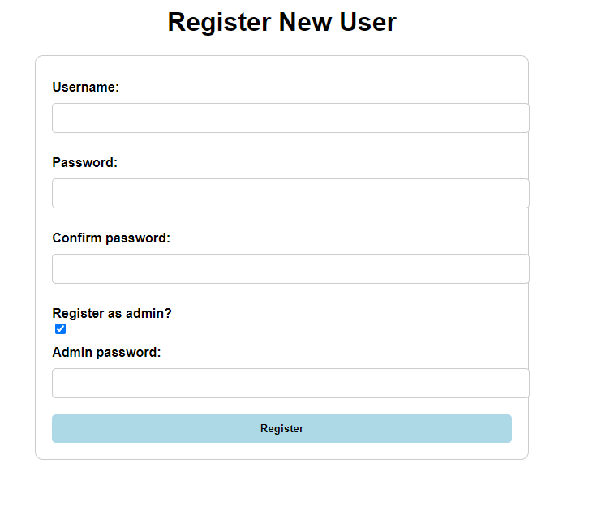

# Nettikauppasovellus

Sovelluksen avulla tavallinen käyttäjä voi kirjautua palveluun, selata kaupassa olemassa olevia tuotteita, lisätä tuotteita ostoskoriin, arvostella tuotteita ja halutessa täyttää tilaustiedot ja läpikäydä teko-maksutapahtuman. Ylläpitäjä voi lisätä/poistaa nettikauppan tuotteita, lisätä nykyisten tuotteiden varastoa ja muunnella esimerkiksi hintoja tai tuotekuvausta.

Ominaisuuksiin lukeutuu alustavasti:

- Rekisteröityminen ja kirjautuminen.
- Nettikaupan saatavilla olevien tuotteiden selaaminen ja lisääminen ostoskoriin.
- Teko-maksutapahtuma ja tilauksen käsittely.
- Tuotearvostelut.
- Ostoshistorian selaaminen.

Alustava tietokantataulurakenne:

- Taulu käyttäjien dataan (mukaanlukien ylläpito)
- Taulu tuotedataan
- Taulu ostoskärrylle
- Taulu käsitellyille ostoksille/tilauksille
- Taulu tuotearvosteluille

## Välipalautus 2

- Sovelluksen nykyinen tilanne (05.02.2023) tarjoaa mahdollisuuden rekisteröitymiseen, sisäänkirjautumiseen, tuotteiden selaamiseen ja etsimiseen ja ylläpitäjä-tason käyttäjille mahdollisuuden uusien tuotteiden lisäämiseen ja nykyisten tuotteiden varaston lisäämiseen.

## Välipalautus 3

- Pieni huomio tähän välipalautukseen on käden sormivamma joka esti minua edistämästä sovellusta haluamaani määrää.

- Sovelluksen nykyinen tilanne (19.02.2023) tarjoaa mahdollisuuden tuotteiden arvioimiseen, arviointien selaamiseen, sekä admin-tason käyttäjille mahdollisuuden poistaa käyttäjiä ja tuotteita. Muitakin parannuksia yleisellä tasolla ks. commitit. Lopulliseen palautukseen jää ostoskorin ja maksutapahtuman toteuttaminen, sekä mahdolliset toiminnallisuudet joita ehdotetaan palautteessa.

## Lopullinen palautus

- Sovelluksen lopullinen tilanne (05.03.2023) tarjoaa alustaviin kaavailtuihin ominaisuuksiin suhteutettuna kiitettävästi toiminnallisuuksia.

- Tavallinen käyttäjä voi rekisteröityä, kirjautua, selata nettikaupan tuotteita, arvostella tuotteita ja tutkia muita arvosteluita, lisätä tuotteita ostoskoriin ja lopulta käydä läpi hyvin nopean, yksinkertaistetun ja suoraviivaisen maksutapahtuman.

- Ylläpito-tason käyttäjällä on samat ominaisuudet kuin tavallisella käyttäjällä, mutta ylläpitäjä voi lisäksi selata kaupan ostoshistoriaa, lisätä tuotteita kauppaan, lisätä tuotteiden varastoa, sekä poistaa käyttäjiä ja tuotteita.

### Toteuttamatta jääneet toiminallisuudet:

- Tekomaksutapahtuma on hyvin yksinkertaistettu ja tyhjä/tylsä. Myöskään yksittäinen käyttäjä ei voi selata omaa henkilökohtaista ostoshistoriaansa. Ylläpitäjä ei myöskään voi suoraan muunnella tuotteiden informaatiota, varastoa lukuunottamatta, vaan joutuu poistamaan ja lisäämään tuotteen uudelleen, mikäli tarve nimi/kuvaus muutoksille tulisi.

- Ostoskoriin lisääminen tapahtuu myös kerralla "könttänä". Jos haluat poistaa/lisätä tietyn määrän tuotetta korista, se ei ole mahdollista vaan joudut päivittämään halutun määrän aina erikseen.

### Tiedettyjä bugeja:

- Store-välilehden Reset-nappi ei toimi oikein jos kaupassa ei ole tuotteita.
- Lisää bugeja saattaa esiintyä muilla järjestelmillä ja on mahdollisesti jäänyt huomaamatta minulta.

### Ohjeet testaamiseen

- Kloonaa kansio ja siirry juurikansioon, minkä jälkeen luo .env-tiedosto, johon määrität käyttämäsi paikallisen tietokannan ja salaisen avaimen:

```
DATABASE_URL = käyttämä tietokantasi
SECRET_KEY = käyttämä salainen avaimesi
```

- Aktivoi halutessasi virtuaaliympäristö, jonka jälkeen lataa vaaditut riippuvuudet:

```
pip install -r ./project-dependencies.txt
```

- Luo sovelluksen tietokantataulut skeemaasi tables.sql-tiedostosta
- HUOM! Tietokantaan on tullut muutoksia lopulliseen palautukseen edellisistä versioista. Uudelleenalustus on välttämätöntä.

- Luo ylläpitäjä-tason käyttäjä rekisteröitymis-sivulta käyttäen admin-salasanaa, joka löytyy routes.py-tiedoston alusta:

```
my_admin_password = "admin123" (routes.py -- tiedoston alussa)
```



- Ylläpitäjä-tason käyttäjä tarvitaan tuotteiden lisäämiseen tietokantaan.

- Käynnistä sovellus ajamalla routes.py-tiedoston koodi.

- Voit halutessasi kokeilla tietokanta yhteyttä "paikallinenosoite/testdatabase" linkin kautta.

```
127.0.0.1:5000/testdatabase
```

# <ins>*Loppuarvionti*</ins>

### Feedback:

- Kaikista palautuksista täydet pisteet.
- Annoit hyödyllistä vertaispalautetta muille opiskelijoille.
- Tietokanta on suunniteltu järkevästi ja se käyttää relaatioita oikein.
- Taulut ja sarakkeet on nimetty kuvaavasti ja yhdenmukaisesti englanniksi.
- Koodissa ei tehdä asioita, jotka voi mielekkäästi tehdä SQL:ssä. Hyvä.
- Tietokantaa käsitellään monipuolisesti SQL-komennoilla (JOIN, REFERENCES ja aggregaatti funktiot: COUNT / SUM yms.).
- Sovelluksessa on tietokanta, jossa on noin 5–10 taulua.
- Virhetilanteissa tulee asianmukainen virheilmoitus, joka kertoo käyttäjälle, mikä meni vikaan ja mitä sen tilanteen korjaaminen vaatii.
- Sovellus toimii, kun käyttäjä testaa sitä, ilman käsittelemättömiä virhetilanteita (esim. 400, 500, yms.).
- Sovelluksen käyttöliittymä ja ulkoasu ovat viimeisteltyjä.
- Sovellusta on miellyttävää käyttää. Käyttöliittymä ottaa käyttäjän huomioon ja käyttäjälle on selvää, mitä sovelluksen toiminnot tekevät.
- Commitit ovat hyviä kokonaisuuksia (ei liian suuria, rajoitettu yhteen ominaisuuteen per commit) ja niissä on hyvät englanninkieliset viestit.
- Tiedosto README.md antaa hyvän kuvan sovelluksesta ja schema.sql antaa hyvän kuvan tietokannan suunnittelusta.
- Versionhallinnassa ei ole sinne kuulumattomia tiedostoja.
- Koodi on jaettu järkevästi osiin moduuleiksi ja funktioiksi.
- Koodi on selkeää, suoraviivaista, tiivistä ja sen muotoilu seuraa Pythonin tyyliohjetta.
- Koodin muuttuja ja funktionimet yms. on kirjoitettu englanniksi ja ne noudattavat samaa tyyliä.
- Versionhallinnassa ei ole salaista tietoa.
- Sovelluksesta löytyy koodia CSRF-haavoittuvuuksia vastaan.
- Käyttäjä ei pääse käsiksi tietoon, johon hänellä ei ole oikeutta.
- Käyttäjän syötteet tarkastetaan ennen tietokantaan tallentamista.
- Salasanat tallennetaan tietokantaan asianmukaisesti.
- Sovelluksessa ei ole SQL-injektiota eikä XSS-haavoittuvuuksia.

- Yhteenvetona:
  
- Koodi on siistiä, hyvin jaoteltua ja dokumentoitua.
- Kuvatut toiminnallisuudet toimii ja on niin admin kuin peruskäyttäjiäkin.
- Virheilmoitukset järkeviä.
- Ulkonäkö selkeä.
- Tietokanta kutsuilla tehty esim avg laskeminen, hyvä!
- Yleisesti ottaen selkeä sovellus ja tietokanta on luotu sekä käsitelty kurssin vaatimalla tavalla. Hyvää työtä!

- grade 5/5
